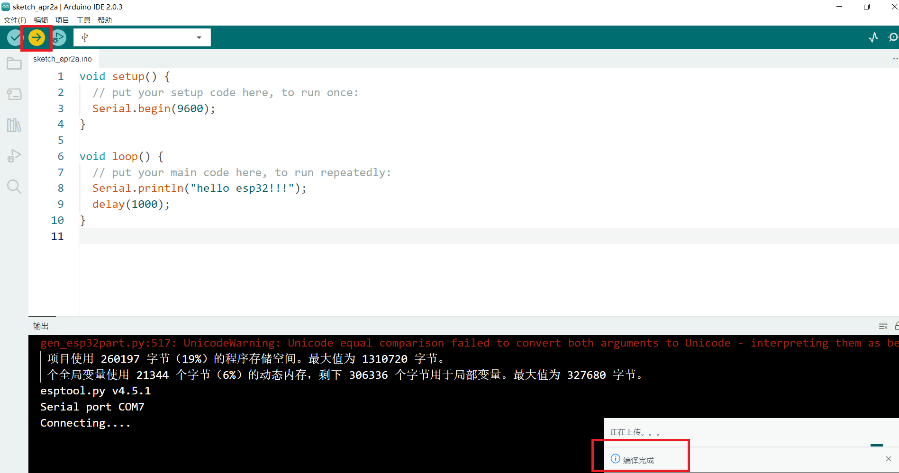
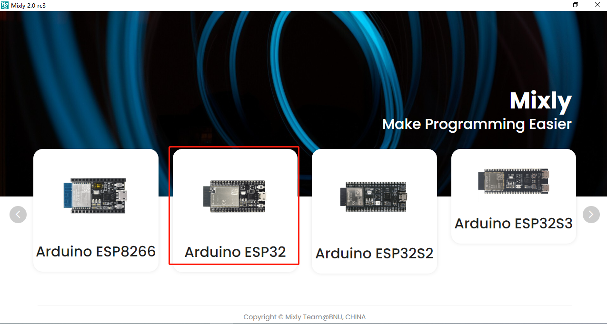
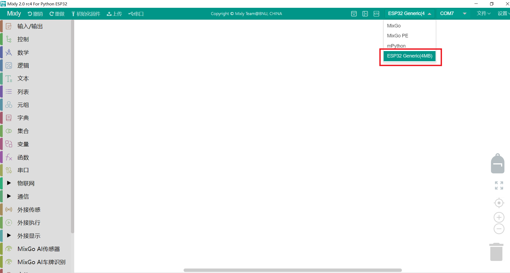

# ESP32软件使用说明

此文档旨在介绍esp32在Arduino IDE丶Mixly丶Mind+等平台的使用方法。

## 一丶通过Arduino IDE下载程序

请前往 [Arduino官网](https://www.arduino.cc/en/Main/Software) 下载最新IDE

1. 打开Ardunio IDE;
2. 安装ESP32库；

1) 点击Arduino IDE菜单栏：【文件】-->【首选项】

*将     <https://dl.espressif.com/dl/package_esp32_index.json>   这个网址复制到附加管理器地址*

2. 菜单栏点击 【工具】->【开发板】->【开发板管理器】搜索esp32，然后安装，如下图：

   

**注：**

下载第一个工具的时候可能会出现错误的情况，这种情况直接重新点击下载就可以了，下载的比较慢，不要着急。

下载第二个工具的时候可能会出现下载错误，不要慌，再试几次如果不行的话，使用手机（不使用流量也可以）开个热点，电脑连手机的热点就可以下载了。虽然下载的较慢，但是步骤极为简单。

安装完成后，打开IDE，先选择主板，如下图

将写好程序点击上传按钮，等待程序上传成功，如下图。

点击串口工具就可以看到串口的打印。如下图

## 二丶Mixly使用(以Mixly2.0为例)

1. 板卡选择

   若是Arduino则选择

MicroPython则选择

2. 主板选择

3. 导入案例

4. 下载

## 三丶Mind+

点击选择FireBeetle ESP32-E主板，如下图

## 四丶MicroPython

详情请参考[在 ESP32 上开始使用 MicroPython —MicroPython中文 1.17 文档](http://micropython.com.cn/en/latet/esp32/tutorial/intro.html)
