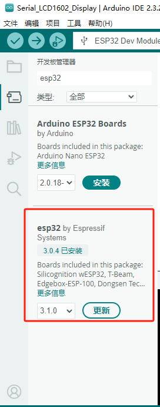
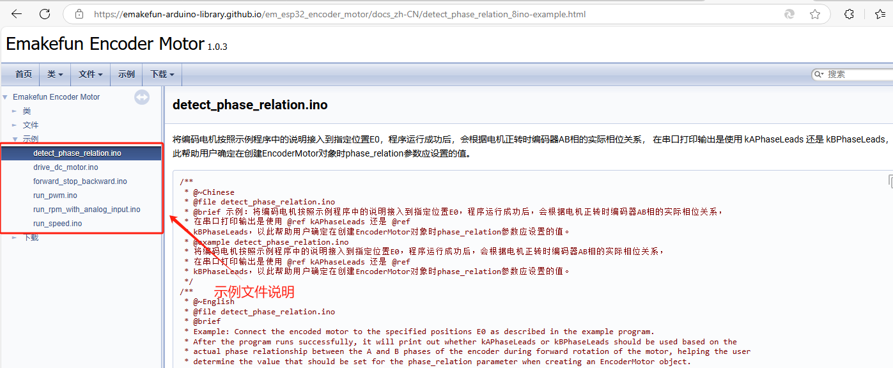
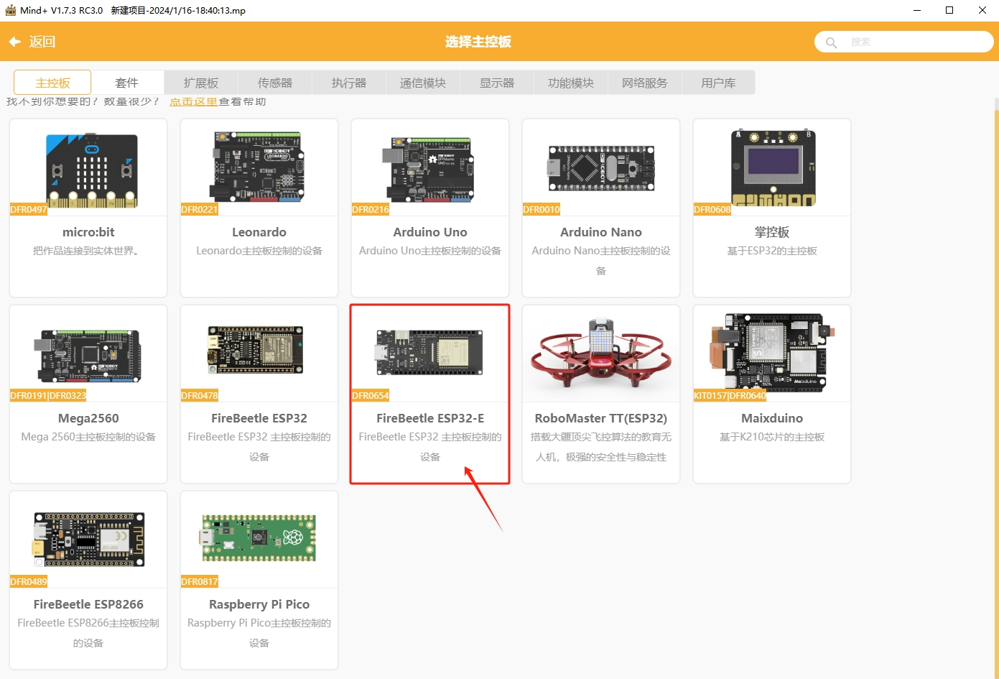

# MAKER-ESP32-PRO 使用说明书

## 模块实物图

## 概述

   MAKER-ESP32-PRO是基于乐鑫科技的 [ESP32-WROOM-32](https://www.espressif.com/sites/default/files/documentation/esp32-wroom-32_datasheet_cn.pdf) 模组基础上开发的一款适用于创客教育的标志性产品，Flash大小4MB，集成 2.4 GHz、Wi-Fi 和蓝牙双模的单芯片方案。采用东芝的电机驱动芯片，电流最大可达3.5A。

## ESP32模组参数

* 448 KB ROM,520 KB SRAM,16 KB RTC SRAM
* QSPI 支持多个 flash/SRAM
* 内置 8 MHz 振荡器
* 支持自校准
* 内置 RC 振荡器，支持自校准
* 支持外置 2 MHz 至 60 MHz 的主晶振（如果使用 Wi-Fi/蓝牙功能，则目前仅支持 40 MHz 晶振）
* 支持外置 32 kHz 晶振，用于 RTC，支持自校准
* 2 个定时器群组，每组包括 2 个 64-bit 通用定时器和 1 个主系统看门狗
* 1 个 RTC 定时器
* RTC 看门狗
* 34 个 GPIO 口 • 12-bit SAR ADC，多达 18 个通道
* 带有专用 DMA 的以太网 MAC 接口，支持 IEEE 1588
* 双线汽车接口（TWAI®，兼容 ISO11898-1） • IR (TX/RX)

## 原理图

[点击查看原理图](zh-cn/esp32/maker_esp32_pro/maker-esp32_pro.pdf  ':ignore')

## 产品参数

* 4个编码电机端口（E0、E1、E2、E3）；4个直流电机端口（M0、M1、M2、M3）；电流最大达到3.5A
* 5个I2C插针接口,1个SPI插针接口
* 4个舵机接口（25、26、32、33）
* 13个IO引脚(5、12、14、15、16、17、18、19、23、34、35、36、39)
* 输入电压： 6-24V
* 产品尺寸：80mm×57mm；PCB厚度：1.6mm；净重：35g
* M4定位孔直径：4.6mm，兼容乐高
* 软件支持Mixly、Arduino IDE、Python

## 引脚说明

待补充

## MAKER-ESP32-PRO驱动安装

驱动安装请参考此文档：[ESP32驱动安装](zh-cn/driver/ch340_driver.md)

## MAKER-ESP32-PRO 通过Arduino IDE下载程序

请前往 [Arduino官网](https://www.arduino.cc/en/Main/Software)  下载最新IDE

1. 打开Ardunio IDE;

2. 安装ESP32库；

   点击菜单栏点击 【工具】->【开发板】->【开发板管理器】搜索esp32，然后安装，如下图：

## 通过Arduino IDE上传程序

和Arduino上传程序一样，先选择主板，如下图

将写好程序点击上传按钮，等待程序上传成功，如下图。

点击串口工具就可以看到串口的打印。如下图

## Mixly使用(以Mixly2.0为例)

1. ### 板卡选择

   

2. ### 主板选择

   

3. ### 导入案例

   

4. ### 下载

   

## Mixly示例程序

[点击下载电机舵机示例程序](zh-cn/esp32/maker_esp32_pro/esp32_mixly/esp32_motor_servo_test.zip ':ignore')

[点击下载舵机示例程序](zh-cn/esp32/maker_esp32_pro/esp32_mixly/esp32_servo_test.zip ':ignore')

[点击下载OLED示例程序](zh-cn/esp32/maker_esp32_pro/esp32_mixly/esp32_oled_test.zip ':ignore')

## Arduino示例程序

[点击下载舵机示例程序](zh-cn/esp32/maker_esp32_pro/esp32_arduino/servoTest.zip ':ignore')

[点击下载OLED示例程序](zh-cn/esp32/maker_esp32_pro/esp32_arduino/oledTest.zip ':ignore')

### 驱动编码电机与直流电机

[点击查看编码电机以及直流电机库和示例程序](https://emakefun-arduino-library.github.io/em_esp32_encoder_motor/)
点击上述链接此处即可下载库文件

#### 驱动电机示例文件以及常用函数说明

##### 示例文件说明

| 文件名                    | 功能说明                                                     |
| ------------------------- | ------------------------------------------------------------ |
| detect_phase_relation     | 帮助用户检测编码电机在正转时编码器A相和B相的实际相位关系。通过让电机正转并读取其转速，程序会判断编码器的相位关系，并将结果通过串口打印出来。 |
| drive_dc_motor            | 通过ESP32平台的PWM输出控制四个直流电机的正反转。程序在启动时初始化四个电机对象，然后在主循环中依次将这些电机设置为正转和反转，每种状态持续1秒。使用库文件中的`Motor`类和相关的初始化及控制方法来实现这一功能。 |
| forward_stop_backward     | 控制四个电机依次进行前进、停止、后退的操作，并通过串口输出实时的电机转速、PWM占空比及脉冲计数。这使得用户可以在运行过程中监控电机的状态，验证电机控制逻辑的正确性。 |
| run_pwm                   | 通过PWM占空比控制四个编码器电机的转动，并实时输出电机的转速、PWM占空比和编码器脉冲计数等信息。 |
| run_rpm_with_analog_input | 根据 ESP32 上的特定 GPIO 引脚（这里为 26）的模拟输入值动态地设置四个编码电机的速度。它利用了 `encoder_motor.h` 和 `encoder_motor_lib.h` 提供的类和函数来实现电机控制，并通过串口输出调试信息，以便跟踪电机的状态。 |
| run_speed                 | 控制四个电机以指定的速度（100RPM）旋转，并通过串口输出每个电机的实时状态信息，包括目标速度、当前速度、PWM占空比和编码器脉冲计数。这有助于了解电机的实际运行情况，并对电机驱动系统进行调试和优化。 |

详情可查看上述链接的如下位置：

##### 常用函数说明

| 函数名                                                   | 功能说明                                                     |
| -------------------------------------------------------- | ------------------------------------------------------------ |
| Init()                                                   | 初始化电机设置。                                             |
| SetSpeedPid(const float p, const float i, const float d) | 使用给定的比例（P）、积分（I）、微分（D）参数值来设置速度PID控制器的参数。 |
| RunPwmDuty(const int16_t pwm_duty)                       | 直接设置电机的PWM占空比。                                    |
| RunSpeed(const int16_t speed_rpm)                        | 以设定的速度值（RPM）运行电机。                              |
| EncoderPulseCount()                                      | 获取编码器脉冲计数。该计数值是在A相下降沿的时候计数，如果是正转会加一，反转则减一。 |
| SpeedRpm()                                               | 获取电机当前的转速（RPM）。                                  |
| PwmDuty()                                                | 获取电机驱动器的PWM占空比。                                  |
| TargetRpm()                                              | 获取电机的目标转速（RPM）。                                  |

更多函数可以参考上方链接的如下位置：

## ESP32系列连接使用PS3蓝牙无线手柄

[点击查看ESP32系列连接使用PS3蓝牙无线手柄](zh-cn/peripheral/bluetooth_gamepad_ps3/bluetooth_gamepad_ps3.md)

[点击下载PS3控制电机舵机案例](zh-cn/esp32/maker_esp32_pro/esp32_arduino/esp32PS3ControlTest.zip ':ignore')

[点击下载Mixly库PS3手柄](zh-cn/esp32/maker_esp32_pro/esp32_mixly/esp32_emakefun_sensors_mixly.zip ':ignore')

[点击下载PS3手柄Mixly示例](zh-cn/esp32/maker_esp32_pro/esp32_mixly/esp32_ps3_rock_test.zip ':ignore')

[点击下载PS3手柄 Mind+库](zh-cn/esp32/maker_esp32_pro/esp32_mindplus/emakefun-ps3.zip ':ignore')

[点击下载PS3手柄 Mind+示例](zh-cn/esp32/maker_esp32_pro/esp32_mindplus/ps3_test.zip ':ignore')

## Mind+示例程序

### 主板选择

   点击选择FireBeetle ESP32-E主板，如下图

   

   [点击下载电机示例程序](zh-cn/esp32/maker_esp32_pro/esp32_mindplus/esp32MindplusMotor.zip ':ignore')
   [点击下载Maker-esp32Mind+库文件](zh-cn/esp32/maker_esp32_pro/esp32_mindplus/emakefun-em_maker_esp32-thirdex-V0.0.2.mpext ':ignore')

## FAQ

**Q**: Mixly下载程序不成功？

**A**：

1. Mixly的安装路径不要包含中文、空格等特殊字符；放在电脑的根目录下，层级目录不要太深；比如                          D:\mixly2.0-win32-x64就是根目录安装；  

2. 查看串口是否选择正确，如果没有串口，请先安装CH340G驱动；串口不要被其他应用占用；
3. 检查程序是否有错误；

**Q**: 电机程序上传成功，但是电机不转？

**A**:

1. 电机需要DC头供电，6-24V，建议使用两节3.7V锂电池，电源开关是否打到ON；

2. 第一步已经完成的话，还出现问题，请检查Motor and IO Switch开关是否拨到电机方向(即标有ON的方向)；
3. 检测程序设置的电机引脚是否和电机实际引脚一一对应；

## 联系我们

**技术 + 合作：TEL:  13242991035(WX同号)**
