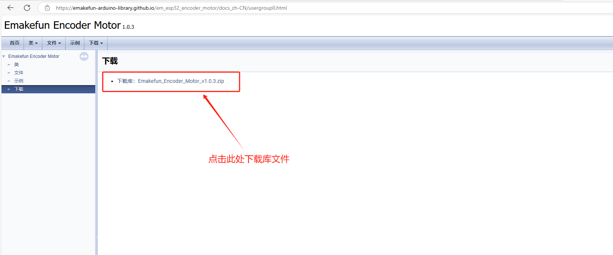
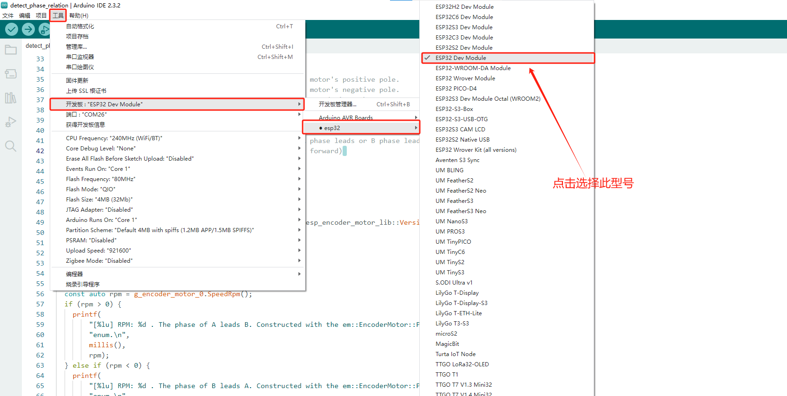
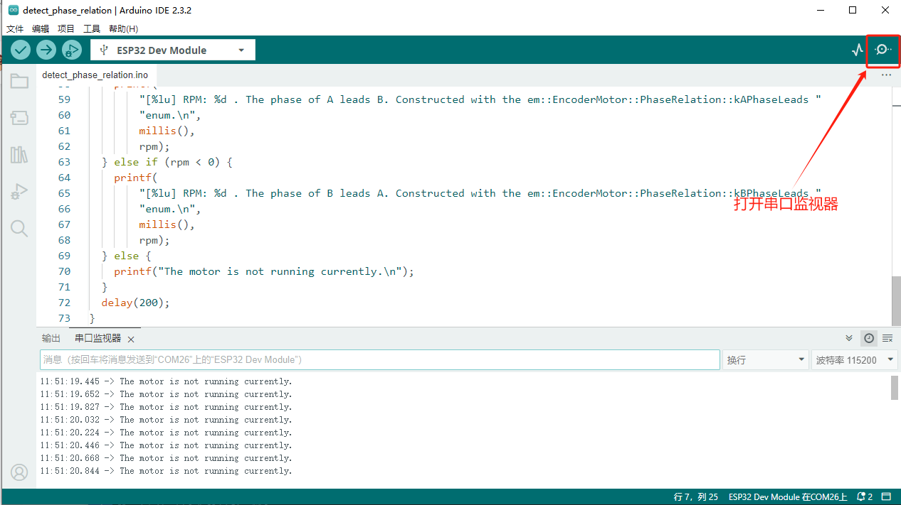
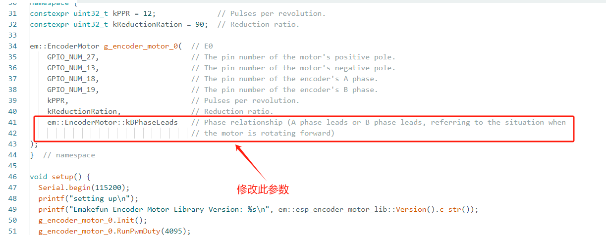

# MAKER-ESP32-PRO 使用说明书

## 模块实物图

## 概述

   MAKER-ESP32-PRO是基于乐鑫科技的 [ESP32-WROOM-32](https://www.espressif.com/sites/default/files/documentation/esp32-wroom-32_datasheet_cn.pdf) 模组基础上开发的一款适用于创客教育的标志性产品，Flash大小4MB，集成 2.4 GHz、Wi-Fi 和蓝牙双模的单芯片方案。采用东芝的电机驱动芯片，电流最大可达3.5A。

## ESP32模组参数

* 448 KB ROM,520 KB SRAM,16 KB RTC SRAM
* QSPI 支持多个 flash/SRAM
* 内置 8 MHz 振荡器
* 支持自校准
* 内置 RC 振荡器，支持自校准
* 支持外置 2 MHz 至 60 MHz 的主晶振（如果使用 Wi-Fi/蓝牙功能，则目前仅支持 40 MHz 晶振）
* 支持外置 32 kHz 晶振，用于 RTC，支持自校准
* 2 个定时器群组，每组包括 2 个 64-bit 通用定时器和 1 个主系统看门狗
* 1 个 RTC 定时器
* RTC 看门狗
* 34 个 GPIO 口 • 12-bit SAR ADC，多达 18 个通道
* 带有专用 DMA 的以太网 MAC 接口，支持 IEEE 1588
* 双线汽车接口（TWAI®，兼容 ISO11898-1） • IR (TX/RX)

## 原理图

[点击查看原理图](zh-cn/esp32/maker_esp32_pro/maker-esp32_pro.pdf  ':ignore')

## 产品参数

* 4个编码电机端口（E0、E1、E2、E3）；4个直流电机端口（M0、M1、M2、M3）端口与编码电机复用；电流最大达到3.5A
* 其中E0(A:18 B:19 +:27 -:13)，E1(A:5 B:23 +:4 -:2)，E2(A:35 B:36 +:17 -:12)，E3(A:34 B:39 +:15 -:14)
* 5个I2C插针接口,1个SPI插针接口
* 4个舵机接口（25、26、32、33）
* 13个IO引脚(5、12、14、15、16、17、18、19、23、34、35、36、39)
* 输入电压： 6-24V
* 产品尺寸：80mm×57mm；PCB厚度：1.6mm；净重：35g
* M4定位孔直径：4.6mm，兼容乐高
* 软件支持Mixly、Arduino IDE、Python

## 引脚说明

## MAKER-ESP32-PRO驱动安装

驱动安装请参考此文档：[CH340G驱动安装](zh-cn/driver/ch340_driver/ch340_driver.md)

## MAKER-ESP32-PRO 上传程序方法

各平台程序上传方法请参考：[ESP32系列上传程序方法](zh-cn/esp32/esp32_software_instructions/esp32_software_instructions.md)

**注意**：使用Arduino IDE开发时，请将esp32更新至最新版本。

## Mixly示例程序

[点击下载电机舵机示例程序](zh-cn/esp32/maker_esp32_pro/esp32_mixly/esp32_motor_servo_test.zip ':ignore')

[点击下载舵机示例程序](zh-cn/esp32/maker_esp32_pro/esp32_mixly/esp32_servo_test.zip ':ignore')

[点击下载OLED示例程序](zh-cn/esp32/maker_esp32_pro/esp32_mixly/esp32_oled_test.zip ':ignore')

## Mind+示例程序

   [点击下载电机示例程序](zh-cn/esp32/maker_esp32_pro/esp32_mindplus/esp32MindplusMotor.zip ':ignore')

   [点击下载Maker-esp32Mind+库文件](zh-cn/esp32/maker_esp32_pro/esp32_mindplus/emakefun-em_maker_esp32-thirdex-V0.0.2.mpext ':ignore')

## Arduino示例程序

[点击下载舵机示例程序](zh-cn/esp32/maker_esp32_pro/esp32_arduino/servoTest.zip ':ignore')

[点击下载OLED示例程序](zh-cn/esp32/maker_esp32_pro/esp32_arduino/oledTest.zip ':ignore')

### 驱动编码电机与直流电机

[点击查看编码电机以及直流电机库和示例程序](https://emakefun-arduino-library.github.io/em_esp32_encoder_motor/html/zh-CN/index.html)

点击上述链接此处即可下载库文件

#### 驱动电机示例文件以及常用函数说明

##### 示例文件说明( [Emakefun Encoder Motor: 示例文件](https://emakefun-arduino-library.github.io/em_esp32_encoder_motor/html/zh-CN/examples.html) )

详情可查看上述链接的如下位置：

##### 常用函数说明( [Emakefun Encoder Motor: 类成员 - 函数](https://emakefun-arduino-library.github.io/em_esp32_encoder_motor/html/zh-CN/classem_1_1_encoder_motor.html#a69db8b9fc364d4d8f2509473d759ed0f) )

更多函数可以参考上方链接的如下位置：

#### 使用Arduino IDE调试编码电机

##### 接线说明

将编码电机的信号线连接到电机驱动板的对应引脚，并外接DC电源，通过typeC接口连接电脑。如下图所示：

##### 添加库文件

打开Arduino IDE，点击项目->导入库->添加.ZIP库，选择下载好的库文件，点击打开，然后点击确定。

等待库文件安装完即可。

选择主板型号，比如我的是ESP32 Dev Module，然后点击确定。

#### 打开示例程序

打开Arduino IDE，点击文件->示例->Emakefun Encoder Motor->detect_phase_relation，然后点击打开。

选择COM口，然后点击上传。

打开电源开关。

打开串口监视器。

我们发现电机开始转动，串口监视器中的RPM为负值。而我们设置的PWM为正值，所以我们应该将构造函数中的phase_relation参数应设置为em::EncoderMotor::kBPhaseLeads。

修改参数后，我们在上传程序，后发现电机开始转动，串口监视器中的RPM为正值。

至此，我们这个示例函数的任务就结束啦。以后我们使用这个编码电机构造函数时，用现在这个参数就可以了。例如下个程序：
.
打开示例程序run_speed。

我们用一个编码电机E0并以上面的示例参数为例，我们应该将构造函数中的phase_relation参数设置为em::EncoderMotor::kBPhaseLeads。

修改参数后，我们在上传程序。后发现我们RPM的输出和我们设置的RPM值基本一致。

我们在将目标速度设置为-20，看看效果。

观察到与我们设置的RPM值基本一致，电机方向也正确。

至此我们编码电机已经调试结束。若发现与我们的预期不符，请再次检查电机连接是否正确，电机驱动板是否有问题，以及电机是否有问题。

## ESP32系列连接使用PS3蓝牙无线手柄

[点击查看ESP32系列连接使用PS3蓝牙无线手柄](zh-cn/peripheral/bluetooth_gamepad_ps3/bluetooth_gamepad_ps3.md)

[点击下载PS3控制电机舵机案例](zh-cn/esp32/maker_esp32_pro/esp32_arduino/esp32PS3ControlTest.zip ':ignore')

[点击下载Mixly库PS3手柄](zh-cn/esp32/maker_esp32_pro/esp32_mixly/esp32_emakefun_sensors_mixly.zip ':ignore')

[点击下载PS3手柄Mixly示例](zh-cn/esp32/maker_esp32_pro/esp32_mixly/esp32_ps3_rock_test.zip ':ignore')

[点击下载PS3手柄 Mind+库](zh-cn/esp32/maker_esp32_pro/esp32_mindplus/emakefun-ps3.zip ':ignore')

[点击下载PS3手柄 Mind+示例](zh-cn/esp32/maker_esp32_pro/esp32_mindplus/ps3_test.zip ':ignore')

## FAQ

**Q**: Mixly下载程序不成功？

**A**：

1. Mixly的安装路径不要包含中文、空格等特殊字符；放在电脑的根目录下，层级目录不要太深；比如                          D:\mixly2.0-win32-x64就是根目录安装；  

2. 查看串口是否选择正确，如果没有串口，请先安装CH340G驱动；串口不要被其他应用占用；
3. 检查程序是否有错误；

**Q**: 电机程序上传成功，但是电机不转？

**A**:

1. 电机需要DC头供电，6-24V，建议使用两节3.7V锂电池，电源开关是否打到ON；

2. 第一步已经完成的话，还出现问题，请检查Motor and IO Switch开关是否拨到电机方向(即标有ON的方向)；
3. 检测程序设置的电机引脚是否和电机实际引脚一一对应；
