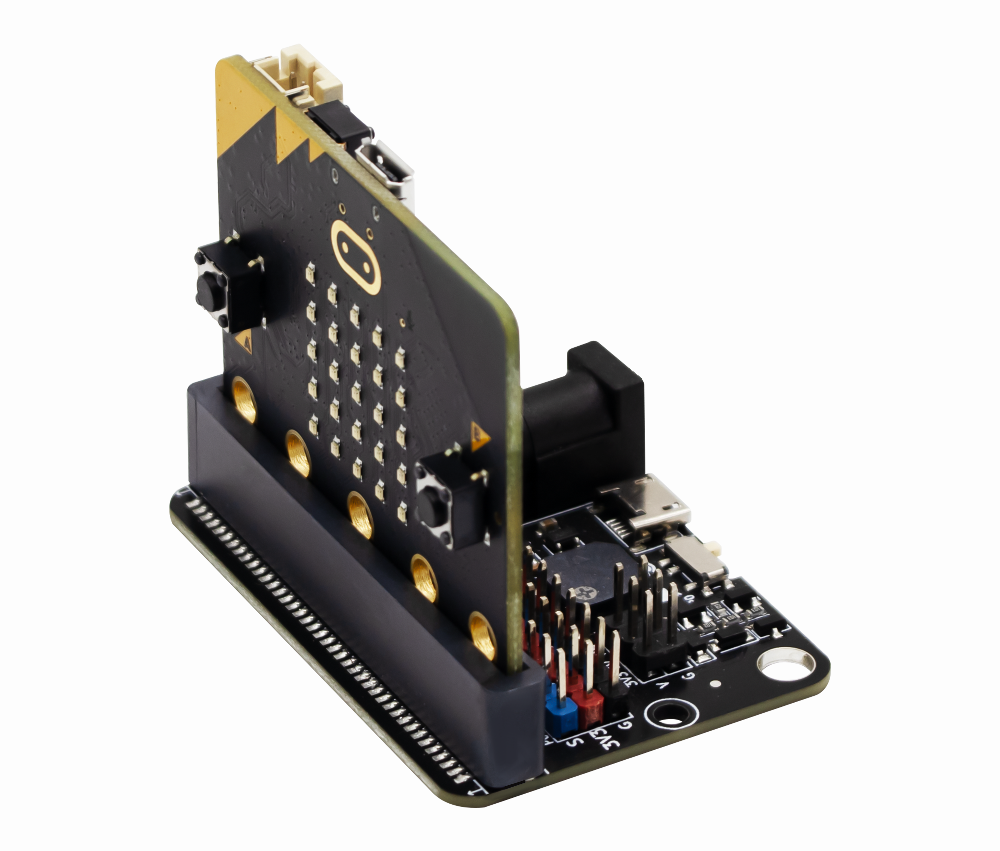
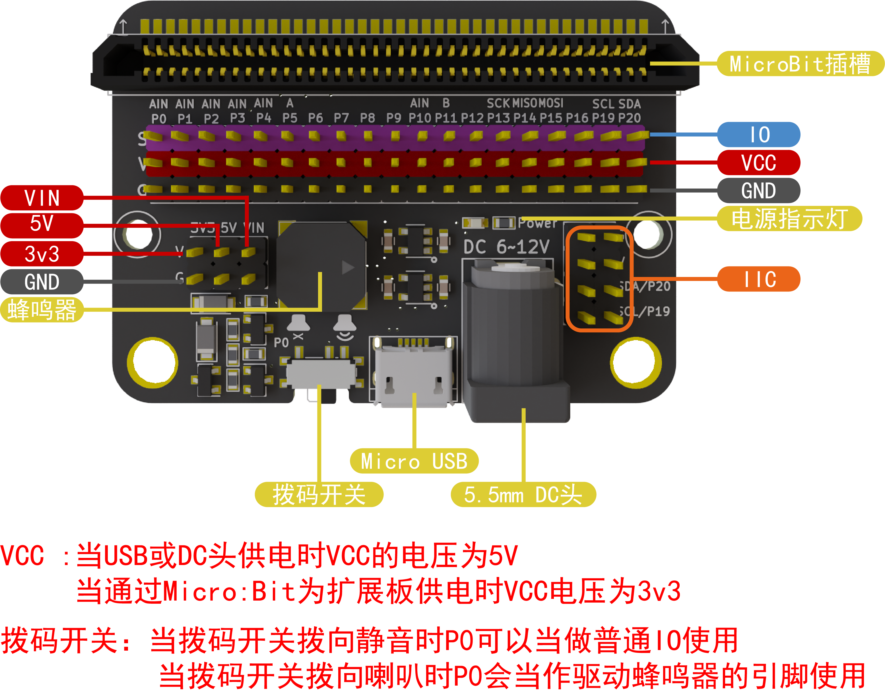
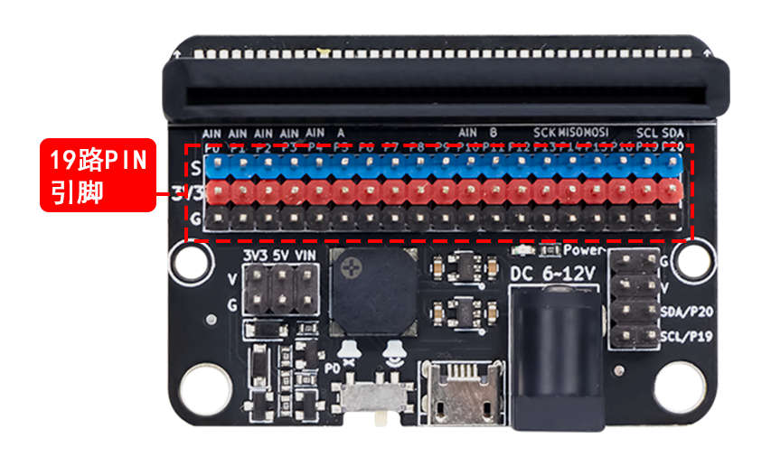
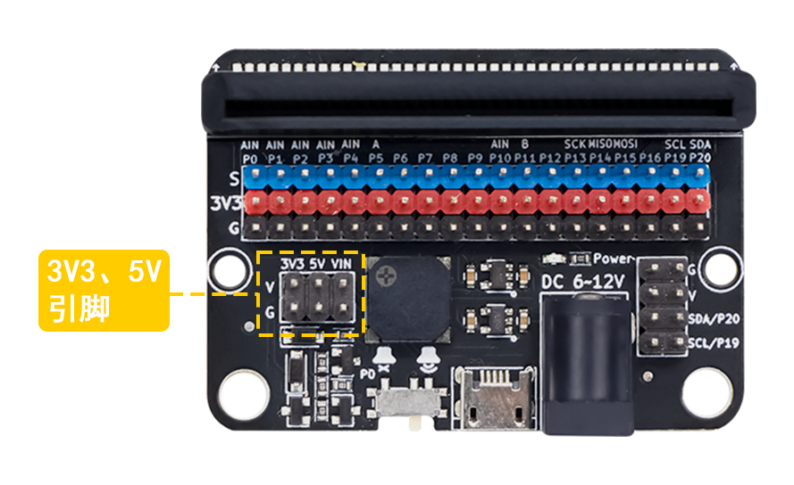
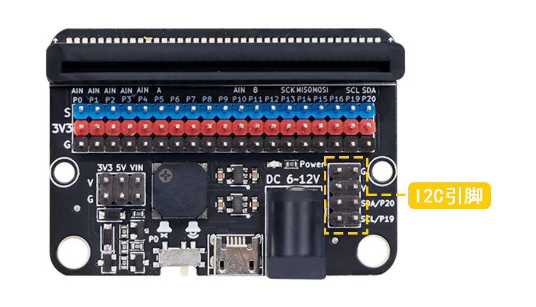

# micro:bit IO扩展板

## IO:bit简介

IO:bit扩展板是一款功能强大的microbit扩展板，其引出microbit主板 19路PIN引脚，每个PIN引脚都有VCC和GND与其对应，可以通过跳线帽自由切换VCC为3V3或5V；含有3个独立的3V3和5V引脚，接线方式更加灵活多样；另外引出I2C的SDA和SCL引脚，以及相应的5V和GND引脚，为I2C通信的LCD1602液晶显示屏等模块连接提供更多可能；板载无源蜂鸣器，通过跳线帽进行连接；供电方式包含DC头和USB插口供电。

## IO:bit参数

- PCB板厚度：1.6mm
- 小圆孔直径：3.0mm
- 大圆孔直径：4.7mm（兼容乐高孔）
- 产品    尺寸：56mm/40mm/15mm
- 净            重：18.7g
- USB  输入电压：5V
- DC头输入电压：6-12V

## 机械尺寸图

## 产品实物图

IO:bit扩展板与microbit主板

## 硬件接口介绍

### IO:bit 引脚介绍

IO:bit扩展板正面功能图

### 19路PIN引脚

IO:bit在设计的过程中，充分考虑到对于想要深入使用microbit引脚开发者，把microbit所有IO口全部引出，并且每个PIN引脚都有相应的标号以及引脚功能的简单标识。引脚的蓝色线代表IO引脚、红色线代表VCC、黑色线代表GND。其中，无源蜂鸣器通过跳线帽与P0引脚相连。

### 3V3、5V引脚

在使用microbit开发的过程中，如果使用需要5V电压的模块，可以通过杜邦线连接在扩展板的5V接口；如果需要3V3电压的模块，可以通过杜邦线连接在扩展板的3V3接口。

### 跳线帽介绍

IO:bit扩展板有两个跳线帽，第一个跳线帽是用来控制扩展板中IO引脚的VCC电压值，可以选择连接3V3或5V
第二个跳线帽是用来控制板载无源蜂鸣器的，当跳线帽引脚Buzzer引脚时，板载无源蜂鸣器与microbit的P0脚接通，可以通过microbit图形化音乐程序积木来播放相应的音乐。

### I2C引脚

IO:bit扩展板19路PIN引脚已经包含有I2C通信的P19和P20引脚，为了使用更加灵活方便，对于I2C通信特别设计完整的I2C通信4个引脚，5V引脚、SCL引脚、SDA引脚、GND引脚。

### 供电插口

IO:bit扩展板有两种供电方式，在使用的过程中，可以使用USB供电或者DC头的电池供电，当扩展板接通能源时，板载的红色电源指示灯会点亮。
