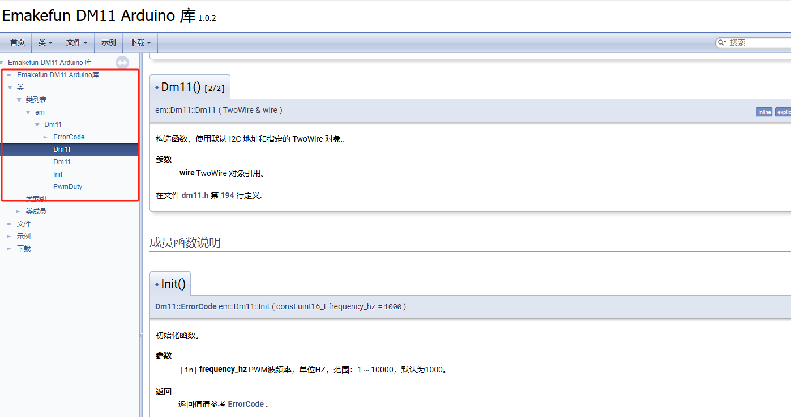
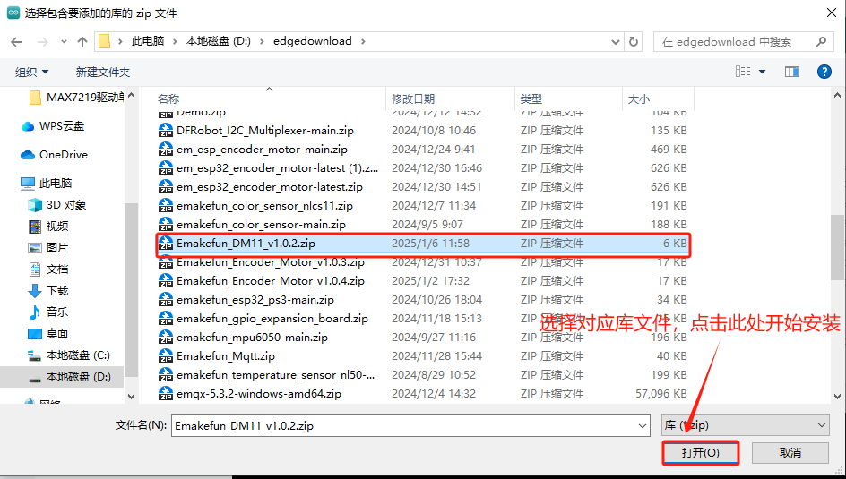

# DM11电机驱动模块

## 模块实物图

## 概述

DM11电机驱动模块是采用了CH32V003芯片，可实现高速、稳定的电机驱动功能。该模块可驱动单个或俩个电机，通过I2C接口与主控板通信，实现电机控制。

### 原理图

[原理图点击此处下载查看](zh-cn/ph2.0_sensors/actuators/dm11/i2c_dual_motor_driver.pdf ':ignore')

### 尺寸图

待补充

## 模块参数

- 工作电压：3.3-5V
- 时钟频率：0-400KHZ
- 接 口：IIC接口和2.0间距接口
- 通信方式: IIC通信，地址0x15
- 尺 寸：22.4*38.4mm，兼容乐高积木和M4螺丝固定孔

## 引脚定义

| 引脚名称 | 描述        |
| -------- | ----------- |
| G        | GND     |
| V        | VCC  |
| SDA      | SDA |
| SCL      | SDL |

## 模块测试

### 接线

| Arduino Uno | DM11 |
| ----------- | ------ |
| VCC           | VCC      |
| GND           | GND      |
| A5          | SCL    |
| A4          | SDA    |

即将DM11模块插入I2C接口即可。（如下图所示）

### 驱动电机示例文件以及常用函数说明

[点击查看直流电机驱动模块库和示例程序](https://emakefun-arduino-library.github.io/em_dm11/html/zh-CN/index.html)

点击上述链接此处即可下载库文件和示例程序。

#### 示例文件说明( [点击查看示例文件说明](https://emakefun-arduino-library.github.io/em_dm11/html/zh-CN/motor_forward_backward_8ino-example.html) )

详情可查看上述链接的如下位置：

#### 常用函数说明( [点击查看常用函数说明](https://emakefun-arduino-library.github.io/em_dm11/html/zh-CN/classem_1_1_dm11.html#a612627d1e1525ebbf46ec575aab220c4) )

更多函数可以参考上方链接的如下位置：

### 调试

打开Arduino IDE，点击项目->导入库->添加.ZIP库，选择下载好的库文件，点击打开，然后点击确定。

等待库文件安装完即可。

选择主板型号，比如我的是Arduino Uno，然后点击确定。

#### 打开示例程序

打开Arduino IDE，点击文件->示例->Emakefun DM11->motor_forward_backward，然后点击打开。

选择COM口，然后点击上传。

打开电源开关。发现电机在不停的正反转即调试成功。

若出现上传失败，请检查电机驱动模块是否连接正确。
