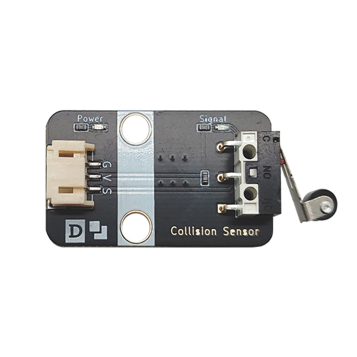
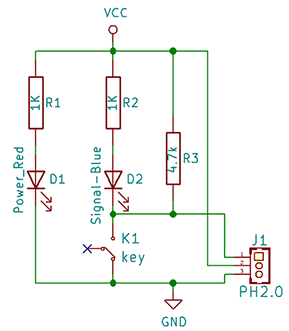
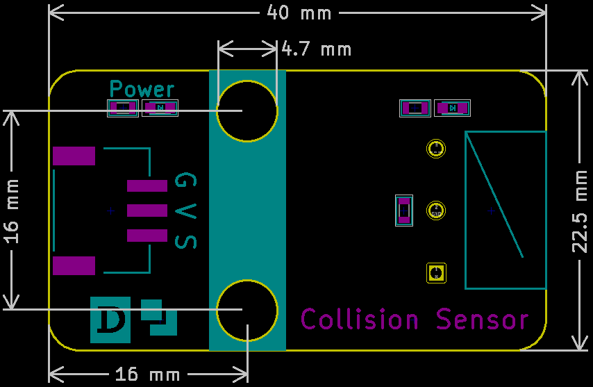

# 碰撞开关

## 实物图



## 概述

​     碰撞开关模块实质为一个微型快动开关，即广为人知的微型开关，是一种由很小的物理力启动的电子开关。它能够直接连在单片机上。它将负载电阻同LED指示灯整合在一起。这使得对他进行测试更为简单。当有物理压力触发开关闭合时，板上的LED指示灯会亮起。碰撞开关的原理比较简单，如下原理图，当被外力触发闭合时，开关闭合，模块输出低电平；当撤销外力时，开关被打开，模块输出高电平。

## 原理图



[原理图下载](zh-cn/ph2.0_sensors/base_input_module/collision_module/collision_module_schematic.pdf ':ignore')

## 模块参数

| 引脚名称 |                            描述                            |
| :------: | :--------------------------------------------------------: |
|    G     |                            GND                             |
|    V     |                            VCC                             |
|    S     | 信号数字输出，开关触发被按下时输出低电平，松开时输出高电平 |

- 供电电压：3V3/5V

- 连接方式：PH2.0 3PIN防反接线

- 模块尺寸：40x22.5mm

- 安装方式：M4螺钉兼容乐高插孔固定

## 机械尺寸图



## Arduino示例程序

[下载示例程序](zh-cn/ph2.0_sensors/base_input_module/collision_module/collision_module.zip ':ignore')

```c
int led_out = 4;//定义LED引脚
int keypad_pin = 3; //定义碰触开关引脚
int collision_value;
void setup()
{
  pinMode(led_out,OUTPUT); //初始化LED连接的引脚为输出引脚
  pinMode(keypad_pin,INPUT); //初始化碰触开关连接的引脚为输入引脚
}
void loop()
{
  collision_value = digitalRead(keypad_pin); //读取碰触开关输入引脚的值
  if (collision_value == LOW) 
  {
      digitalWrite(led_out,HIGH); //如果读取值为低，即碰触开关被按下去，LED亮
  }
  else
  {
      digitalWrite(led_out,LOW); //如果读取值为低即碰触开关没有被按下，LED灭
  }
}
```

## Mixly示例程序

[下载示例程序](zh-cn/ph2.0_sensors/base_input_module/collision_module/collision_module.zip ':ignore')

## micro:bit示例程序

<a href="https://makecode.microbit.org/_RDJbzTDUX2RW" target="_blank">动手试一试</a>
