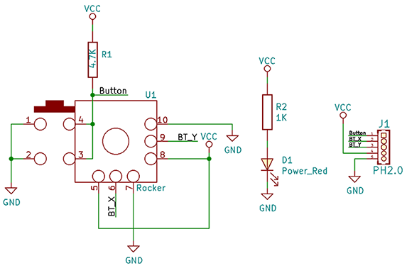
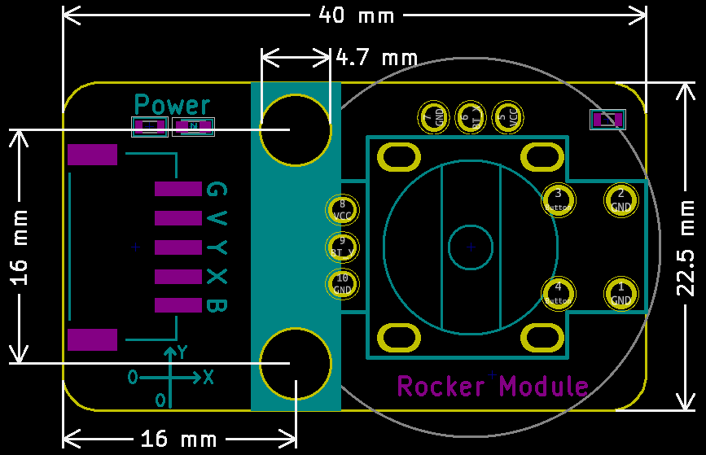

# 摇杆模块

## 实物图


## 概述

​  PS2摇杆包含一个触摸按钮（B款没有）和两个电位器（X轴和Y轴）。 操纵杆根据两个触点控制运动，其中一个触点向左和向右，另一个向上和向下。 操纵杆移动决定了触点的位置，就像地球的纬度和经度一样，不同的位置对应不同的电压，然后控制器可以通过AD传感器读取不同的电压值，从而识别特定的远程位置。当没有操作时，X 和 Y 轴方向输出的模拟值为中间值，即最大值的一半。

## 原理图



[点击此处查看原理图](zh-cn/ph2.0_sensors/base_input_module/rocker_module/rocker_module_schematic.pdf ':ignore')

## 模块参数

| 引脚名称 |               描述               |
| :------: | :------------------------------: |
|    G     |               GND                |
|    V     |               VCC                |
|    X     |       获取摇杆上下动的数据       |
|    Y     |       获取摇杆左右动的数据       |
|    B     | 通过高低电平，判断按键是否被按下 |

- 供电电压：3V3/5V

- 连接方式：PH2.0 5PIN防反接线

- 模块尺寸：40x22.5mm

- 安装方式：M4螺钉兼容乐高插孔固定

## 机械尺寸图



## Arduino示例程序

[下载示例程序](zh-cn/ph2.0_sensors/base_input_module/rocker_module/rocker_module.zip ':ignore')

```c
#define JOYSTICK_X    A5  //定义X输入引脚
#define JOYSTICK_Y    A4  //定义Y输入引脚
#define JOYSTICK_B    2   //定义按键输入引脚

int value_x, value_y, value_b; //定义记录模拟输入的变量
void setup()
{
  pinMode(JOYSTICK_X, INPUT);  //初始化X引脚
  pinMode(JOYSTICK_Y, INPUT);  //初始化Y引脚
  pinMode(JOYSTICK_B, INPUT_PULLUP);  //初始化按键引脚
  Serial.begin(9600);  //设置波特率
}

void loop()
{
  Serial.print("X Value:");
  Serial.println(analogRead(JOYSTICK_X));//读取摇杆X轴值并打印出来
  Serial.print("Y Value:");
  Serial.println(analogRead(JOYSTICK_Y));//读取摇杆Y轴值并打印出来
  if (digitalRead(JOYSTICK_B) == LOW) {  //如果按键按下则打印enter
    Serial.println("enter");//打印enter 
  }
  delay(100);
}
```

## Mixly示例程序

[下载示例程序](zh-cn/ph2.0_sensors/base_input_module/rocker_module/rocker_Mixly_demo.zip ':ignore')

## micro:bit示例程序

<a href="https://makecode.microbit.org/_ahq11cX1E6JT" target="_blank">动手试一试</a>
