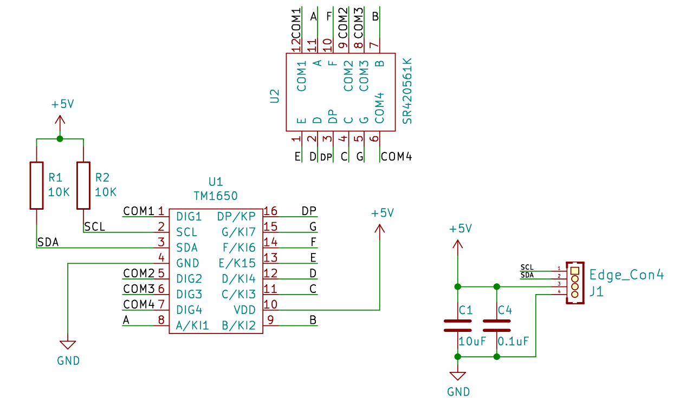

# TM1650数码管显示模块规格书

## 模块图

## 概述

​  4位7段数码管由一个12管脚的4位7段共阳极数码管和一个控制芯片TM1650构成。该模块采用沉金工艺，外观更加美观，同时采用防插反接口，操作更加安全，插口一边有大写字母IIC表示该模块采用IIC协议通信。此产品可以应用在显示数字的设备上。

## 原理图

[点击查看原理图](zh-cn/ph2.0_sensors/displayers/tm1650/TM1650.pdf ':ignore')

## 模块参数

| 引脚名称 | 描述     |
|------|--------|
| G    | GND 地线 |
| V    | 5V电源引脚 |
| DIO  | 数据引脚   |
| CLK  | 时钟引脚   |

## 机械尺寸

## Arduino IDE示例程序

[点击下载Arduino示例程序](zh-cn/ph2.0_sensors/displayers/tm1650/_4x7Segment_Display.zip ':ignore')

## MicroPython示例程序

[点击下载ESP32 MicroPython示例程序](zh-cn/ph2.0_sensors/displayers/tm1650/tm1650_esp32_micropython.zip ':ignore')

[点击下载micro:bit MicroPython示例程序](zh-cn/ph2.0_sensors/displayers/tm1650/tm1650_microbit_micropython.zip ':ignore')

## Mixly示例程序

[点击下载Mixly示例程序](zh-cn/ph2.0_sensors/displayers/tm1650/tm1650_mixly.zip ':ignore')

## micro:bit示例程序

<a href="https://makecode.microbit.org/_5AVM1M6WWFTJ" target="_blank">动手试一试</a>
