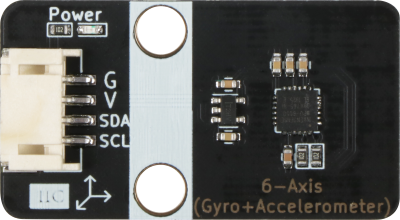

# MPU6050六轴陀螺仪

## 实物图

## 概述

MPU6050是一款集成了三轴加速度计和三轴陀螺仪的惯性测量单元（IMU）。它通过使用MEMS（微电子机械系统）技术，能够以精确、高速的方式测量物体在三个轴向上的加速度和旋转角速度。该传感器组件非常小巧，体积小，功耗低，可方便地集成到各种移动设备、工业机器人、车辆控制系统等中。

MPU6050采用数字输出接口，可以通过**I2C**总线与主控设备进行通信。它的数据输出速率可调，可实现从200Hz到8000Hz的测量频率。此外，MPU6050还具有内置温度传感器，能够提供物体环境的温度信息。

内置**DMP（Digital Motion Processor）**，可直接输出四元数，减轻外围微处理器的工作负担且避免了繁琐的滤波和数据融合。

MPU6050传感器具备出色的稳定性和高精度的测量能力。它可以准确地测量和记录物体的加速度和角速度，以实现运动追踪、姿态检测、手势识别等功能。通过结合适当的算法和数据处理技术，MPU6050能够为用户提供可靠且准确的测量结果。

该产品适用于各种需要惯性测量功能的应用领域。例如，它可以用于智能手机和平板电脑中的姿态感知、运动跟踪和手势识别，使用户能够通过倾斜、旋转设备来控制界面操作。此外，MPU6050也可应用于工业自动化、航空航天和汽车领域，用于姿态控制、机器人导航、飞行姿态稳定等。

总之，MPU6050是一款高度集成、性能优越、适用范围广泛的惯性测量单元。它能够提供准确、可靠的运动和姿态测量数据，为各种应用领域的设备和系统增加智能和精确控制能力。

### 原理图

[点击查看MPU6050原理图](zh-cn/ph2.0_sensors/smart_module/mpu6050/MPU6050.pdf ':ignore')

### 尺寸图

## 特性

- 工作电压：3 ~ 5V

- 通信方式：I2C

- 接口类型：PH2.0-4Pin (G V SDA SCL)

## 应用场景

| 应用场景 | 描述 |
| --- | --- |
| 平衡车 | 使用MPU6050控制平衡车的姿态和运动跟踪，实现自平衡和动作控制 |
| 飞行器导航 | 将MPU6050应用于无人机、四轴飞行器等飞行装置，实现姿态稳定、飞行轨迹跟踪和运动控制 |
| 姿势检测 | 利用MPU6050检测物体的倾斜、旋转和姿态变化，应用于虚拟现实设备、游戏控制器等场景中的姿势识别和运动跟踪 |
| 机器人控制 | 使用MPU6050实现机器人导航和动作控制，包括运动追踪、姿态调整和路径规划等功能 |
| 运动追踪装置 | 利用MPU6050制作个人运动追踪装置，记录和分析运动员的运动数据，如步数、跑步速度和身体姿势等 |
| 姿态稳定系统 | 应用MPU6050开发的稳定系统，包括相机防抖装置、光学稳定器等，以确保图像或光线传感器的平稳运动 |
| 智能手势识别 | 利用MPU6050开发的手势识别系统，通过检测手部的运动和姿势，实现手势控制智能设备 |

总之，MPU6050可以在平衡车、飞行器、姿势检测、机器人控制等创客场景中发挥重要作用，提供精确的姿态和运动数据，实现各种智能和控制功能。

## 硬件描述

### 引脚

| 引脚名称 | 描述         |
| -------- | ------------ |
| V        | 5V电源引脚   |
| G        | GND 地线     |
| SDA      | IIC 数据引脚 |
| SCL      | IIC 时钟引脚 |

## 软件描述

`EMakeFun`提供了该模块的软件库，开启了MPU6050内置的DMP模块，让用户更精确和方便地获取重力在每个轴（x、y、z）方向上的分量，可以用于判断当前传感器的姿态，把它想象成一个水平仪，用于检测向哪个方向倾斜。类似于手机的重力感应，可以判断哪个方向垂直朝下，对屏幕内容做出横屏或竖屏切换。除此之外用户还可以通过该库获取欧拉角（yaw、pitch、roll），其中yaw是相对于初始化时的方向，pitch和roll是相对于水平位置。使用者需要自行查阅资料学习欧拉角相关知识。

### Arduino应用

- Arduino库和示例程序下载：[点击下载](https://github.com/emakefun-arduino-library/emakefun_mpu6050/archive/refs/tags/latest.zip)

- API文档：[点击查看](https://emakefun-arduino-library.github.io/emakefun_mpu6050/class_mpu6050.html)

软件使用方法可参照[Arduino IDE使用说明](zh-cn/software/arduino_ide/arduino_ide.zh-CN.md)

#### 示例程序

- 获取重力分量：[点击查看](https://emakefun-arduino-library.github.io/emakefun_mpu6050/get_acceleration_8ino-example.html)

- 获取欧拉角：[点击查看](https://emakefun-arduino-library.github.io/emakefun_mpu6050/get_euler_8ino-example.html)

### MicroPython示例程序

[点击此处下载mpu6050Esp32MicroPython示例程序](zh-cn/ph2.0_sensors/smart_module/mpu6050/mpu6050_esp32_micropython.zip ':ignore')

由于micro:bit内置加速读计，因此不再提供示例程序。

## 其他参考资料

- MPU6050 DataSheet：[点击查看](https://www.cdiweb.com/datasheets/invensense/mpu-6050_datasheet_v3%204.pdf)

- MPU6050 Register Map: [点击查看](https://invensense.tdk.com/wp-content/uploads/2015/02/MPU-6000-Register-Map1.pdf)
