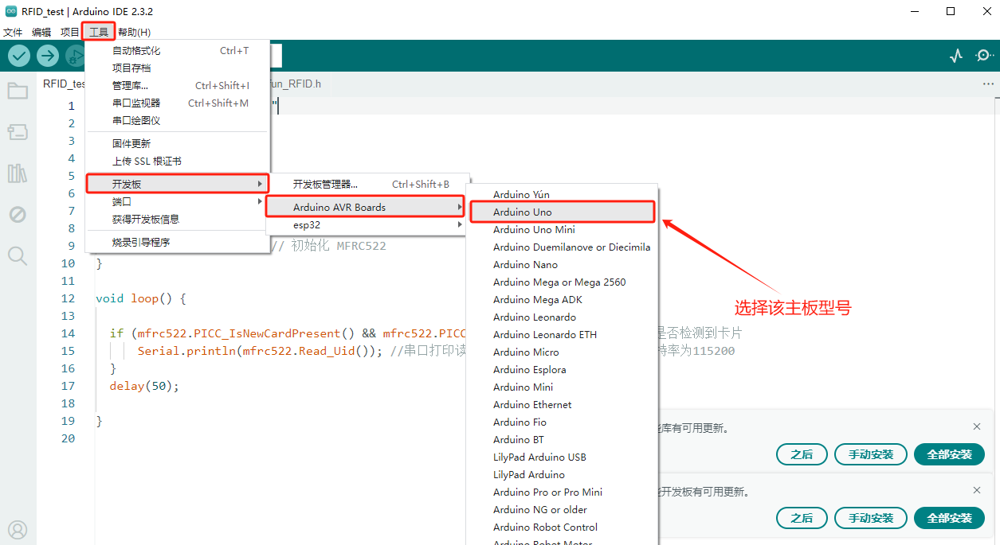
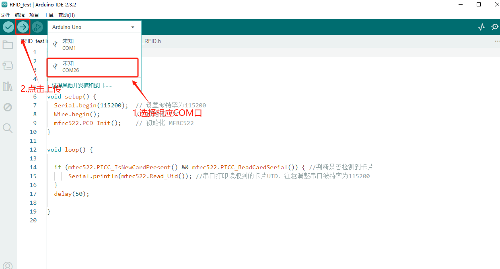
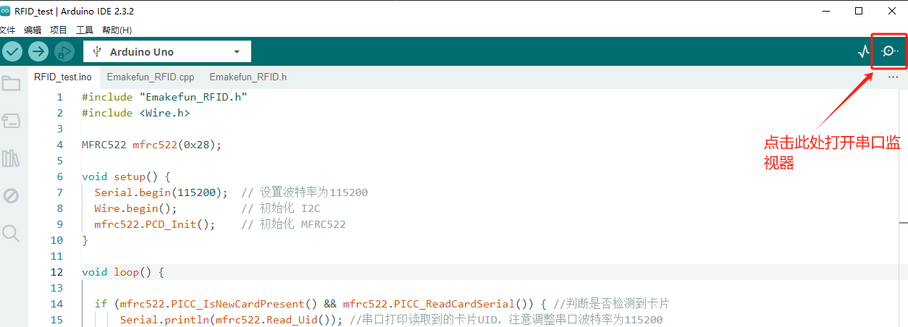

# RFID-I2C模块

## 模块实物图

## 概述

射频识别（RFID）是 Radio Frequency Identification 的缩写。

RFID技术的基本工作原理：标签进入阅读器后，接收阅读器发出的射频信号，凭借感应电流所获得的能量发送出存储在芯片中的产品信息（Passive Tag，无源标签或被动标签），或者由标签主动发送某一频率的信号（Active Tag，有源标签或主动标签），阅读器读取信息并解码后，送至中央信息系统进行有关数据处理。

一套完整的RFID系统，是由阅读器与电子标签也就是所谓的应答器及应用软件系统三个部分所组成，其工作原理是阅读器（Reader）发射一特定频率的无线电波能量，用以驱动电路将内部的数据送出，此时Reader便依序接收解读数据，送给应用程序做相应的处理。

RFID 的应用非常广泛，目前典型应用有动物晶片、汽车晶片防盗器、门禁管制、停车场管制、生产线自动化、物料管理。

## 原理图

待补充

## 芯片规格书

待补充

## 尺寸图

待补充

## 模块参数

| 工作电压5V       | 工作电流：13-100mA/DC 5V               |
| -------------------- | -------------------------------------- |
| 空闲电流：10-13mA/5V | 休眠电流：<80uA                        |
| 峰值电流：<100mA     | 工作频率：13.56MHz                     |
| 通讯协议：I2C        | 功率：<0.5W                            |
| 长宽尺寸：56*40mm    | 重量：7.6g                             |
| 支持多种卡片读写：   | RFID电子标签，钥匙扣，钱币卡，IC白卡等 |
| 通信地址：0x28       |                                        |

## 模块测试

### 接线

| Arduino Uno | RFID模块 |
| ----------- | ------ |
| VCC           | VCC      |
| GND           | GND      |
| A5          | SCL    |
| A4          | SDA    |

RFID模块接在拓展板I2C端口上即可。

### 测试

1.将[资料](#jump)中的Arduino 示例代码解压至相应目录。

2.打开RFID_test.ino文件。

3.选择开发板型号，并将开发板连接到电脑。（以Arduino Uno为例）

4.选择相应COM口然后点击上传。

5.上传成功后，打开串口，波特率设置为115200。

6.将卡片放置在RFID模块上，串口会输出卡片的ID信息。

## 开发板

| 支持开发板系列 |
| :------------- |
| Arduino UNO R3 |
| Arduino Nano   |
| ESP32          |
| Micro:Bit      |

## 资料下载

| 资料目录                                |
| --------------------------------------- |
| Arduino库和示例程序（C/C++）            |
| ESP32库和示例程序（C/C++，MicroPython） |
| Micro:Bit库和示例程序（MicroPython,MakeCode）    |

[上述资料点击此处下载](zh-cn/ph2.0_sensors/smart_module/rfid_mfrc522/data_collection.zip ':ignore')
