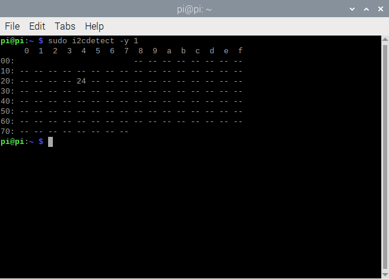

# RaspberryPi-Sensor-Board V4.0
[English](README.md) 中文版   
 树莓派传感器扩展板是由[深圳市易创空间科技有限公司](http://www.emakefun.com)专门为方便树莓派外接传感器而设计。本扩展板适用于 Raspberry Pi Zero/Zero W/Zero WH/A+/B+/2B/3B/3B+/4B。 可以通过5.5-2.1mm的DC头或者接线柱可以给树莓派供电。预留了RF24L01模块，HC-SR04超声波模块，I2C接口，UART接口，支持8路ADC。同时空出摄像头和 DIP 显示屏排线接口。 


## 特点

- 内置10bit ADC MCU，支持8路ADC检测，ADC值范围为0 ~ 1023
- 支持树莓派 2B/3B/3B+/4B/zero
- 5.5x2.1DC头与接线端子外部供电。
- 外接传感器供电电压3V3与5V切换
- 板载DC-DC降压芯片 宽电压输入：5~36V 电压输出：5V 最大电流输出: 5A ，可以给树莓派直接供电

## MCU规格
- 工作电压：3.3V和5V 根据跳线帽选择 ADC检查电压
- 与树莓派通信方式: I2C 速率 1~400K
- I2C地址： 0x24，背面可以配置地址
- IO: 8路ADC检测 对应引脚A0~A7
- 8路扩展模式支持ADC输入，GPIO，PWM（只A1-A2支持），

## 寄存器

&ensp;&ensp;&ensp;&ensp;扩展板MCU I2C地址为0x24，寄存地址说明如下：


  - 0x01寄存器为模式设置

    如下模式可以设置

    | 命令 | 模式         | 功能描述                                                     |
    | ---- | ------------ | ------------------------------------------------------------ |
    | 0x01 | 输入上拉     |                                                              |
    | 9x02 | 输入下拉     |                                                              |
    | 0x04 | 浮空输入模式 |                                                              |
    | 0x08 | 输出模式     | 可把引脚配置为高低电平输出模式，然后使引脚输出高电平或者低电平 |
    | 0x10 | ADC模式      | 可把引脚配置为ADC模式，然后读取引脚的ADC值，精度10位，ADC值范围为0 ~ 1023 |
    | 0x20 | PWM输出模式  | 可配置扩展板的PWM输出频率（1 ~ 10000Hz），然后把引脚为PWM输出模式，再配置引脚PWM输出的占空比(12位精度：0 ~ 4095)，然后使引脚输出PWM，可用于驱动**舵机** |

  - 0x10 ~ 0x17: 读取ADC原始数据

  - 0x20 ~ 0x27: 读取输入电压，单位是mv

  - 0x30 ~ 0x37: 读取输入电压与输出电压的比,输入电压/输出电压(0~100)

  - 0x40 ~ 0x47: 读取或者是设置A0-A7的数字值

  - 0x51 ~ 0x52: 设置A1-A2的PWM占空比

  - 0x61 ~ 0x62: 设置A1-A2的PWM的频率

##    树莓派I2C库安装

&ensp;&ensp;&ensp;&ensp;打开树莓派终端输入"sudo raspi-config"命令，然后按照下图顺序依次操作即可。


&ensp;&ensp;&ensp;&ensp;以上就是开启树莓派I2C，接下来我们安装树莓I2C库在终端输入“sudo apt-get install i2c-tools”，输入完成后就可以看到正在下载I2C库，安装完成之后可以在终端输入“sudo i2cdetect -l”检测是否安装正确，若出现类似于下面的信息就说明安装正常。


&ensp;&ensp;&ensp;&ensp;在终端输入“sudo i2cdetect -y 1”命令即可扫描接在I2C总线上的所有I2C设备，并打印出该设备的I2C总线地址，且我们的扩展板的I2C地址为0x24。



!!! 编辑config.txt文件设置树莓派IIC总线速度

    sudo nano /boot/config.txt

查找包含“dtparam=i2c_arm=on”的行，添加“，i2c_arm_baudrate=100000”，其中100000是新设置的速度(100kbit /s)，注意i2c前面的逗号。完整代码如下：

    dtparam=i2c_arm=on,i2c_arm_baudrate=100000

这样可以启用I2C总线的同时，也完成了新波特率的设置。编辑完成后，使用CTRL-X，然后选择Y，再按下回车键，保存文件并退出。


重新启动树莓派，使新的设置生效:

    sudo reboot

## 读取ADC模拟值

&ensp;&ensp;&ensp;&ensp;众所周知，Raspberry Pi中没有ADC，因此不能直接读取传感器的模拟值。在扩展板内置的I2C ADC MCU的帮助下可以读取10位ADC这就意味着可以在树莓派上使用模拟传感器，且一共有8个可用的接口。

&ensp;&ensp;&ensp;&ensp;模拟传感器将模拟电压输入10位模数转换器。模数转换器将模拟数据转换成数字数据后，通过I2C将数字数据输入到树莓派中。


### Python代码

```
     import time
     import smbus as smbus
    
     ADC = smbus.SMBus(1)    # Declare to use I2C 1
    
     while True:
          ADC.write_byte(0x24, 0x10)    # Write a byte to the slave
          print(ADC.read_word_data(0x24, 0x10))    # Raspberry Pi reads the data returned by the expansion board and prints it out
          time.sleep(1)#
```

### C代码

```
    #include<stdio.h>    // 导入基础库
    #include<wiringPi.h>    // 导入树莓派WiringPi编码IO控制库
    #include<wiringPiI2C.h>    // 导入树莓派WiringPi编码I2C控制库
    int value;//定义一个变量
    int main (void){
        wiringPiSetup();    // 初始化WiringPi编码。
        wiringPiI2CSetup(0x24);    // 打开I2C设备,0x24为扩展板上MCU I2C地址
        while(1){
            wiringPiI2CWrite(0x24,0x10);    // 往从机写一个字节
            value = wiringPiI2CReadReg16(0x24,0x10);    // 读取从机指定地址的两个字节，并赋值给value
            printf("%d\r\n",value);    // 打印value
            delay(100);
        }
    }
```

&ensp;&ensp;&ensp;&ensp;如果在生成当前文件时出现以下错误：


&ensp;&ensp;&ensp;&ensp;如果出现这种问题时请修改生成命令入下图设置：

&ensp;&ensp;&ensp;&ensp;&ensp;&ensp;&ensp;&ensp;Compile&ensp;&ensp;&ensp;&ensp;&ensp;&ensp;&ensp;&ensp;gcc -Wall -c "%f"

&ensp;&ensp;&ensp;&ensp;&ensp;&ensp;&ensp;&ensp;Build&ensp;&ensp;&ensp;&ensp;&ensp;&ensp;&ensp;&ensp;gcc -Wall -o "%e" -lwiringPi "%f"

&ensp;&ensp;&ensp;&ensp;&ensp;&ensp;&ensp;&ensp;Lint&ensp;&ensp;&ensp;&ensp;&ensp;&ensp;&ensp;&ensp;cppcheck --language=c --enable=warning,style --template=gcc "%f"


##  数字高低电平输入


## 数字高低电平输出


##  PWM输出
树莓派原本的硬件pwm只有GPIO1 GPIO26 GIPIO23 GPIO24对应的WiringPi就是1，26，23，24但是不同库支持的输出不一样，使用和树莓派本身的硬件资源冲突，比如声卡，定时器等。所以本扩展板外扩2路pwm可以很好解决这个问题。但是只有A1和A2两个引脚支持


## 舵机控制
有了PWM的支持，那么我们也可以将此pwm扩展成驱动舵机的接口

